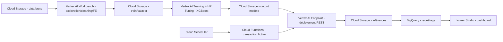

# Projet de détection de fraude — Étapes GCP

## 0. Préparation de l'environnement GCP

* Création d'un projet GCP (`gcloud projects create`) et activation de la facturation
* Activation des API nécessaires :
  ```bash
  gcloud services enable storage.googleapis.com \
    aiplatform.googleapis.com \
    cloudfunctions.googleapis.com \
    cloudscheduler.googleapis.com \
    bigquery.googleapis.com \
    run.googleapis.com
  ```
* Création à la main **et** via un client Python (`google-cloud-storage`) d'un bucket **Cloud Storage**
* Organisation du bucket (structure équivalente à S3) :
  ```
  gs://mon-bucket-fraude/
  ├── data/
  ├── train/
  ├── validation/
  ├── test/
  └── output/
  ```
* Configuration de base : authentification (`gcloud auth application-default login`), compte de service dédié, rôles IAM (`Storage Admin`, `Vertex AI User`, etc.)

**Infra GCP :** Cloud Storage (GCS), IAM

---

## 1. Exploration, nettoyage et feature engineering

* Lancement d'une instance de notebook via **Vertex AI Workbench**
* Exploration / analyse des données (Data analysis)
* Nettoyage des données (Data cleaning)
* Feature engineering (création de variables pertinentes pour la fraude)

**Infra GCP :** Vertex AI Workbench (Notebook instance)

---

## 2. Préparation des données pour l'entraînement

* Split du dataset : 70 % train / 15 % validation / 15 % test
* Sauvegarde des 3 sous-ensembles dans Cloud Storage (`train/`, `validation/`, `test/`)

**Infra GCP :** Cloud Storage

---

## 3. Entraînement du modèle

1. Choix de l'algorithme **XGBoost**
2. Configuration des hyperparamètres
3. Lancement d'un **Hyperparameter Tuning Job** (Vertex AI) + entraînement
4. Sauvegarde du modèle entraîné dans Cloud Storage (`output/`)

**Infra GCP :** Vertex AI Training (Custom Jobs), Vertex AI Hyperparameter Tuning, Cloud Storage

---

## 4. Déploiement en production

* Import du modèle entraîné dans le **Vertex AI Model Registry**
* Création d'un **endpoint Vertex AI** à partir du modèle
* Exposition du modèle sous forme de REST API pour l'inférence en temps réel (directement via l'endpoint Vertex AI, ou via **API Gateway** GCP en façade)

**Infra GCP :** Vertex AI Endpoints, API Gateway (GCP)

---

## 5. Génération de transactions fictives (simulation)

* **Cloud Scheduler** déclenche un événement toutes les minutes
* **Cloud Functions** (ou Cloud Run) génère une transaction fictive et l'envoie au endpoint Vertex AI (REST API) pour obtenir une prédiction de fraude
* Sauvegarde des inférences (résultats de prédiction) dans Cloud Storage
* Récupération des données générées pour un ré-entraînement futur si besoin

**Infra GCP :** Cloud Scheduler, Cloud Functions (ou Cloud Run), Cloud Storage

---

## 6. Exposition des données

* Les données (format Parquet) stockées dans Cloud Storage sont requêtées via **BigQuery** (tables externes pointant vers GCS, ou chargement dans BigQuery)

**Infra GCP :** BigQuery

---

## 7. Reporting / Dashboard

* Connexion de **Looker Studio** à BigQuery pour créer des dashboards de visualisation
* Analyse des décisions prises par le modèle (taux de fraude détecté, faux positifs, tendances, etc.)

**Infra GCP :** Looker Studio

---

## Table de correspondance AWS → GCP

| Service AWS                         | Équivalent GCP                              |
|--------------------------------------|----------------------------------------------|
| S3                                    | Cloud Storage (GCS)                          |
| SageMaker Notebook Instance           | Vertex AI Workbench                          |
| SageMaker Training Jobs               | Vertex AI Training (Custom Jobs)             |
| SageMaker Hyperparameter Tuning       | Vertex AI Hyperparameter Tuning              |
| SageMaker Endpoint                    | Vertex AI Endpoints                          |
| API Gateway (AWS)                     | API Gateway (GCP)                            |
| CloudWatch Events / EventBridge       | Cloud Scheduler                              |
| Lambda                                | Cloud Functions / Cloud Run                  |
| Athena                                | BigQuery                                     |
| QuickSight                            | Looker Studio                                |

---

## Pipeline global


